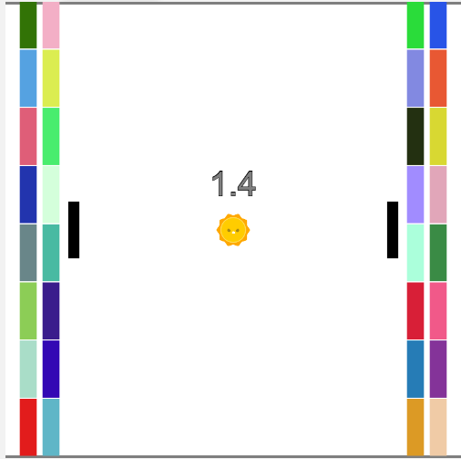

# Super-Pong

A small game made using code.org's gamelab and JavaScript that combines the classic games of Pong and Brickbreaker with  local multiplayer.
It runs through code.org's gamelab and as a result utilizes a lot of code from the code.org gamelab API. I only created the indicated portion of the code.js 
file found in the repository.
This readme's purpose is mainly to provide proper credit to code.org as well as a small manual for the game.

The game works exactly like Pong, the goal is to score the ball into the opponents goal. The winner is the first person to score into the other player's goal. However, there is now
an added line of defense in the form of 16 breakable bricks. When the ball hits these bricks, they disappear, and thus the player must be careful to protect the bricks.

**CONTROLS:**

Player 1:

  Move Paddle Up: 'W'  
  Move Paddle Down: 'S'
  
Player 2:

  Move Paddle Up: 'Up'
  Move Paddle Down: 'Down'
  
 Speed Up Ball: '1' and 'Z' simultaneously 
 
 __(Only use when ball gets stuck with low horizontal velocity)__
